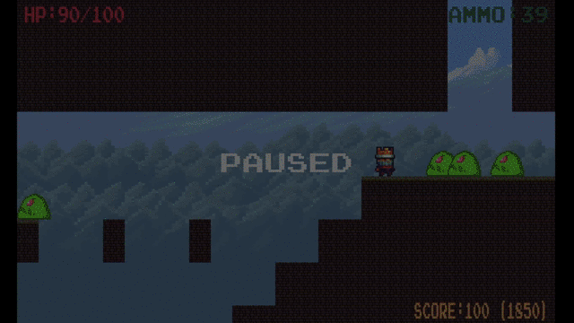
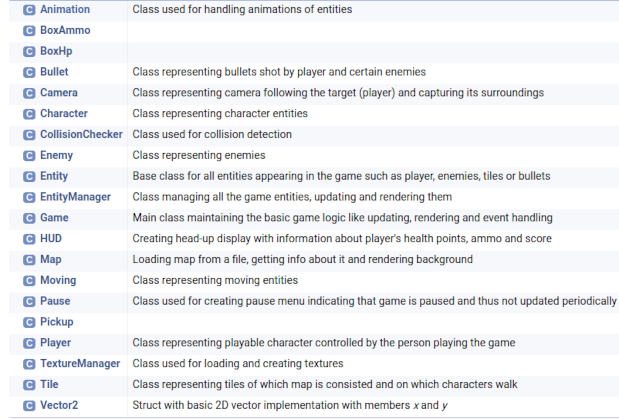

# Lumír the Heartshooter

    

 

Unbelievable adventures of Lumír the Heartshooter is a C++ platform shooter made with [SDL](https://www.libsdl.org/).

Your goal is to defeat all enemies attacking on you with help of your powerful ability to shoot hearts.

Killing enemies elevates your final score. You can see your score in the bottom right corner of the screen together with the high score in brackets. The more score points you have, the more you get and that's worth it! There is also a small chance that enemy will drop a bonus box upon its death, pick it up to refill some of your resources.

But be aware, touching enemies can badly hurt you! You lose an amount of your health point depending of strength of the enemy. When your HP drop below zero, game instantly ends and you lost.

To get some rest, you can pause the game anytime you want with Escape key.

## List of classes

    

